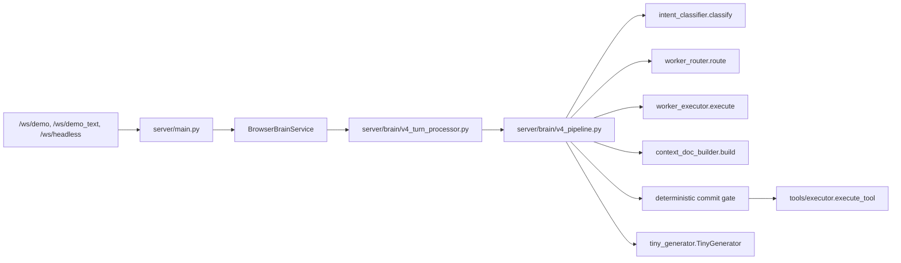

# Builder Audit

This audit records what Sailly already has, where it lives, and whether it is configurable as data or still bound into code. The central finding is that the live production brain is the v4 deterministic pipeline under `server/brain`, not the older `server/training` node graph referenced by some historical docs.

## Repo Topology

| Path | Git status | Role | Notes |
|---|---:|---|---|
| `/home/charles2/sailly-browser-demo` | Git repo, branch `master`, no remote configured | Live FastAPI voice brain, Pipecat websocket runtime, builder API | Backend builder foundations are here. |
| `/home/charles2/sailly` | No `.git` | Production monorepo-style working tree: Node API, dashboard source, website | Live dashboard source lives here but is not version-controlled on this host. |
| `/home/charles2/sailly/apps/dashboard` | No `.git` | Live Next.js dashboard served by `sailly-dashboard.service` | Contains current Builder UI routes. |
| `/home/charles2/sailly-mvp-complete` | Git repo with CodeCommit remote | Historical MVP branch | Does not contain the current `app/builder` dashboard. |
| `/home/charles2/sailly-dashboard`, `/home/charles2/sailly-dashboard-deployed` | No `.git` | Old standalone dashboard artifacts | Stale build artifacts, not current Builder source. |

Systemd confirms the live services use:

| Service | Working directory | Port | Runtime |
|---|---|---:|---|
| `sailly-browser-demo.service` | `/home/charles2/sailly-browser-demo` | `8080` | `uvicorn server.main:app` |
| `sailly-dashboard.service` | `/home/charles2/sailly/apps/dashboard` | `3001` | `.next/standalone/server.js` |

Important deployment/config note: `apps/dashboard/next.config.mjs` rewrites `/api/builder/*` using `VOICE_AGENT_ORIGIN || http://127.0.0.1:3003`, while the live FastAPI browser-demo service is on `8080`. Nginx currently makes the live public `/api/builder/*` route work, but the dashboard build-time rewrite default is not aligned with the service unit.

## Live Runtime Path

The production conversation path is:

`server/brain_service.py` imports `V4TurnProcessor as ADKTurnProcessor`, so the old ADK name still appears in comments and type names. The actual runtime brain is v4.

## Stale Or Legacy Surfaces

| Path/symbol | Status | Why it matters |
|---|---|---|
| `server/training/conversation_nodes.py` | Legacy/training copy | Requested in the prompt, but not live runtime source of truth. |
| `server/training/node_manager.py` | Legacy/training copy | Useful for historical comparison, not production routing. |
| `server/brain/conversation_nodes.py`, `server/brain/layer1/nodes/*` | Compatibility/legacy node graph | Defines per-node prompts/tool lists, but v4 live path routes through profiles/workers instead. |
| `server/brain/node_manager.py` | Legacy forced-commit/routing layer | Large keyword/forced-tool layer; v4 uses `intent_classifier`, `worker_router`, and `context_doc_builder` gates. |
| `server/brain/adk_turn_processor.py` | Legacy brain | Some Redis/session restore compatibility remains, but production imports v4. |
| `server/brain/memory_manager.py` | Legacy ADK prompt assembly | v4 uses `ContextDocument` plus `TinyGenerator`; MemoryManager is not the live per-turn source. |
| `server/brain/response_variations.py` | Legacy/inactive in v4 | Hardcoded German variation pools; not central to current runtime. |

Planning implication: a Vapi-class builder should target the v4 pipeline and only treat the old node graph as design inspiration or migration material.

## Subsystem Inventory

| Subsystem | What it does | Where it lives | Current configuration source |
|---|---|---|---|
| Websocket runtime | Accepts browser/headless sessions, builds Pipecat transport, wires STT, brain, TTS, and output | `server/main.py` | Mixed: tenant YAML for some STT/TTS settings, environment variables for API keys/projects, Python for pipeline structure |
| STT wiring | Deepgram STT/Flux settings and endpointing | `server/main.py`, `server/brain/stt/deepgram_client.py`, `server/providers/registry.py` | Partial YAML/data-driven via `configs/tenants/*.yaml` `audio`; runtime provider support is code-bound |
| VAD/turn taking | Silero VAD and related pipeline processors | `server/main.py` | Python code-bound constants |
| Brain service | Converts transcript into response frames, tracks metrics/session | `server/brain_service.py` | Mostly Python code-bound; data writes to Redis/Postgres |
| v4 pipeline | Deterministic per-turn flow: classify, route, worker execution, context doc, commit gate, generator | `server/brain/v4_pipeline.py` | Python code-bound |
| Intent classification | Regex/Haiku intent and turn-type classification | `server/brain/intent_classifier.py` | Python code-bound regex/routing, optional LLM fallback via env |
| Worker routing | Maps intents to worker profiles and deadlines | `server/brain/worker_router.py` | Python code-bound, with partial YAML override for enabled profiles |
| Worker execution | Runs worker profiles and collects findings/tool candidates | `server/brain/worker_executor.py`, `server/brain/workers/*` | Python code-bound |
| Context document | Builds grounded context and commit requirements | `server/brain/context_doc_builder.py` | Python code-bound slot maps; tenant content comes from YAML |
| Commit gate | Ensures required slots and readback before commit tools | `server/brain/v4_pipeline.py`, `server/brain/context_doc_builder.py` | Python code-bound, limited YAML optional-slot overlay |
| Response generator | Produces short grounded response | `server/brain/tiny_generator.py` | Mostly Python code-bound; model/provider not yet fully tenant-configured |
| Conversation state | Holds slots, flags, intents, known menu items, end-call state | `server/brain/conversation_state.py` | Mixed: YAML menu injected, many keyword/blocklist/rules code-bound |
| TTS conditioning | Persona and speaking-style directives | `server/brain/tts_conditioning.py`, `server/brain/tts/tts_conditioning.py` | Mixed: YAML `tts.*` for some voice/rate; situation styles/persona mostly Python |
| Tool schemas | Describes callable tools | `tools/definitions.py`, `configs/tenants/*.yaml` `tools` | Split source of truth: hardcoded Python plus tenant YAML |
| Tool execution | Executes orders, reservations, FAQ, transfer, end call, etc. | `tools/executor.py`, `server/tools/handlers/*` | Mixed: handler Python and GUARDIAN checks code-bound; menu/business data YAML |
| Guardian/preconditions | Prevent unsafe commit tool calls | `tools/executor.py` `_GUARDIAN_PRECONDITIONS`, `_guardian_pre_commit_check()` | Python code-bound |
| Tenant registry | Loads and caches tenant YAML | `server/core/tenant_config.py` | YAML/data-driven |
| Tenant configs | Business identity, prompt, menu, restaurant info, tools, Twilio numbers, audio, voice/model, locale | `configs/tenants/default.yaml`, `doboo.yaml`, `pizzeria_napoli.yaml` | YAML/data-driven, but not all fields are consumed by v4 |
| Provider catalogs | Lists STT/LLM/TTS provider options | `configs/providers/*.yaml`, `server/providers/registry.py` | YAML catalog plus Python runtime adapters |
| Industry packs | Business capability templates for Builder | `configs/industry_packs/*.yaml`, `server/builder/capabilities.py` | YAML/data-driven |
| Builder API | Graph introspection, code view, tenants, providers, scenarios, runtime | `server/builder/routes.py` | Mixed: reads Python introspection, reads/writes YAML for limited knobs |
| Builder graph introspection | Derives current v4 profiles/intents/tools/guards from code | `server/builder/graph_introspect.py` | Python introspection, not declarative graph data |
| Dashboard Builder UI | Flow canvas, per-turn canvas, commit gate, workflows, scenarios, new tenant wizard | `/home/charles2/sailly/apps/dashboard/app/builder` | TS/UI-only plus API calls; workflow canvas is not persisted as runtime graph |
| Call metrics | Stores per-turn latencies/tools/node/profile/confidence/build/tenant | `server/database.py`, `google_turn_metrics` | DB/data-driven |
| Live trace | Stores append-only live events in Redis | `server/live_call_trace.py`, `server/session.py`, `server/main.py` | Redis/data-driven, volatile |
| Monitor API | Aggregates recent call health | `server/monitoring.py`, `server/main.py` | Mixed Redis/in-memory/env; monitor config functions exist but routes are incomplete |
| Admin call viewer | HTML and JSON call turn replay | `server/main.py` `/api/admin/call/{sid}/turns`, `/admin/call/{sid}` | DB/data-driven content, code-bound HTML |
| Regression harness | Runs scripted caller scenarios over headless websocket | `server/tests/regression/harness.py`, `server/tests/regression/scenarios/*` | Scenario files data-driven; assertion evaluator code-bound |
| Browser validation | Runs validation batches and pushes report data | `server/training/run_browser_validation.py` | Scenario/report data-driven; scoring code-bound |
| Baselines | Stores historical validation results/trends | `tests/baselines/*`, `server/tests/regression/baselines/*` | Data-driven, manually enforced |

## What Is Already Data-Driven

| Capability | Data source | Notes |
|---|---|---|
| Tenant identity/content | `configs/tenants/*.yaml` | Includes `system_prompt`, business info, menu, locale, Twilio numbers, audio fields, TTS fields, tool definitions. |
| Menu/prices/restaurant facts | `configs/tenants/*.yaml` | Used by tools and state-known-item hydration. |
| Some STT/TTS knobs | `configs/tenants/*.yaml` `audio`, `tts` | Provider catalog exists, but not every provider has runtime adapter. |
| Provider option catalog | `configs/providers/*.yaml` | Useful for UI options; runtime still partial. |
| Industry capability templates | `configs/industry_packs/*.yaml` | Builder template data, not yet runtime graph data. |
| Scenario definitions | `configs/scenarios`, `test-infra/caller-bot-v4/scenarios`, regression JSONL/YAML | Multiple formats, not unified. |
| Call metrics/replay | Postgres `google_turn_metrics`, `google_calls` | Strong basis for Vapi-style observability. |
| Live call trace | Redis keys `live_trace:{call_sid}` or `{tenant}:live_trace:{call_sid}` | Good for live debugging, not durable. |

## What Is Still Code-Bound

| Capability | Code-bound source | Builder implication |
|---|---|---|
| Runtime graph/topology | `v4_pipeline.py`, `intent_classifier.py`, `worker_router.py`, workers | A drag-and-drop graph cannot currently become runtime behavior without Python changes. |
| Edge/routing conditions | Regex and mapping in `intent_classifier.py`, `worker_router.py` | Current routing is deterministic and testable, but not editable as graph data. |
| Worker profile definitions/deadlines | `worker_router.py`, worker modules | Needs config schema or overlay to expose in Builder. |
| Commit slot requirements | `context_doc_builder.COMMIT_TOOLS_REQUIRED_SLOTS`, optional slots | Required slots are Python; optional slots can be partially patched. |
| GUARDIAN safety layer | `tools/executor.py` | Should remain first-class and visible in Builder, but not freely removed by users. |
| Tool execution behavior | Python handlers and `tools/executor.py` | YAML tool schema is not enough to create new arbitrary tools. |
| TinyGenerator model/prompt behavior | `tiny_generator.py` | Tenant `model` exists, but live v4 generator is not fully provider-configurable. |
| VAD/turn-taking pipeline | `server/main.py` constants | Needs tenant-safe config lifting. |
| TTS situation/persona styles | `server/brain/tts_conditioning.py` | Some voice/rate config exists; style logic is Python. |
| Workflow canvas runtime | Dashboard ReactFlow state | Current workflow builder is not saved/published as runtime config. |

## Builder Surface Today

| Route | File | Current status |
|---|---|---|
| `/builder` | `/home/charles2/sailly/apps/dashboard/app/builder/page.tsx` | Reads live code graph via `/api/builder/graph`, renders flow/per-turn/commit-gate canvases. |
| `/builder/workflows` | `/home/charles2/sailly/apps/dashboard/app/builder/workflows/page.tsx` | Drag/drop capability canvas, client-side only; no runtime save/publish. |
| `/builder/scenarios` | `/home/charles2/sailly/apps/dashboard/app/builder/scenarios/page.tsx` | Scenario CRUD and run-record creation. Scenario execution is not fully attached. |
| `/builder/tenants/new` | `/home/charles2/sailly/apps/dashboard/app/builder/tenants/new/page.tsx` | A-Z wizard creates YAML preview and tenant file, but does not fully provision graph/runtime/workers. |

Backend API lives in `server/builder/routes.py` and includes `/api/builder/graph`, `/diagrams`, `/code/{module}`, `/tenants`, layer GET/PUT, providers, capabilities, scenarios, calls/replay, runtime records, proposals, and agent-run endpoints. It is a strong introspection/admin base, not yet a complete runtime graph editor.

## Observability And Validation Readiness

| Vapi-like need | Sailly surface | Status |
|---|---|---|
| Call logs | Postgres `google_calls`, `google_turn_metrics`; dashboard call pages | HAVE (data-driven) |
| Turn replay | `/api/builder/call/{sid}/turns`, `ReplayBar` | HAVE, but only exposes a subset of metric columns |
| Live trace | Redis live trace and `/api/dashboard/live/{sid}/trace` | PARTIAL; routing/proxy alignment needs verification |
| Evals/simulations | Regression harness JSONL/YAML, browser validation | HAVE (different shape), needs unified Builder UI |
| Scorecards | Auditors/scorers in validation code | PARTIAL/code-bound |
| Boards | Dashboard analytics/monitor pages | PARTIAL; not Builder-native |
| DEV/UAT/PROD environments | None formalized | MISSING |

## Main Audit Conclusions

1. Sailly already has a production-grade deterministic voice architecture, but the runtime graph is Python, not data.
2. Tenant YAML is strong for business content and some audio/model knobs, but not for graph topology, per-node prompts, variables, transition rules, or guard definitions.
3. Tooling is split across tenant YAML, global Python declarations, and handler code. A Builder needs one canonical tool registry plus explicit runtime adapters.
4. Observability is a strength: `google_turn_metrics`, Redis live trace, call viewer, and regression harness can power Vapi-like evals and dashboards.
5. The existing Builder is an introspection and admin UI. It is not yet a source-of-truth workflow editor.
6. The old `server/training` / ADK node model should not be used as the primary implementation plan. The plan should target v4 and migrate toward config-driven v4 graph overlays.
