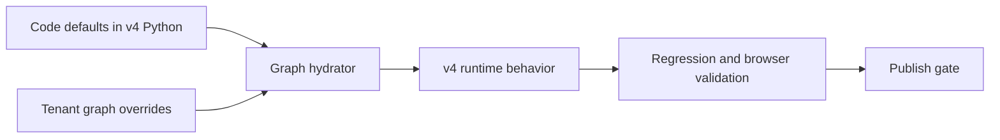
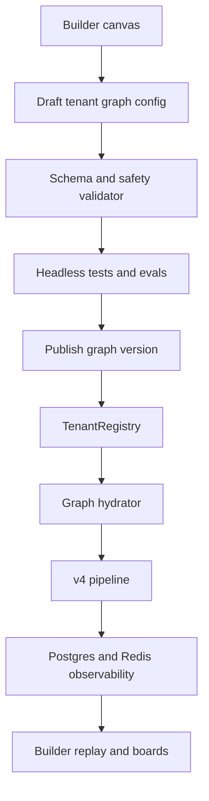

# Builder Plan

This plan describes how to reach a Vapi-class drag-and-drop voice-agent builder while preserving Sailly’s own architecture: deterministic routing, commit gates, GUARDIAN preconditions, Pipecat runtime, tenant YAML, Postgres metrics, Redis live trace, and regression harnesses.

## Decision

Recommendation: **Option C first, then Option A.**

- Start with **Option C: Hybrid config overlays** so production keeps the current v4 Python defaults while the Builder can edit prompts, tool lists, variables, provider knobs, routing keywords, and safe optional gates per tenant.
- Migrate to **Option A: Config-driven graph** once the schema, validators, regression gates, and rollout mechanics are proven.
- Reject **Option B as the long-term product shape**. Code-diff proposals are useful for engineering review, but they cannot become a smooth Vapi-class no-code builder.

## Why Not Jump Directly To Full Option A

The live system is code-first:

- `server/brain/v4_pipeline.py` owns the turn sequence and commit gate.
- `server/brain/intent_classifier.py` and `server/brain/worker_router.py` own routing.
- `server/brain/context_doc_builder.py` owns required slot maps.
- `tools/executor.py` owns GUARDIAN preconditions and tool execution.

Moving all of that into tenant config in one step risks live calls. A dual-read migration is safer:



## Target Architecture

The Builder should write a versioned tenant assistant config. Runtime should hydrate that config into the existing v4 engine.



## Proposed Config Schema

This can begin in YAML under `configs/tenants/<id>.yaml` and later move to a DB table with versioning. YAML is acceptable for P0/P1 because the current tenant registry already loads YAML.

```yaml
assistant:
  id: doboo
  display_name: DOBOO Korean Soulfood
  industry: restaurant
  locale: de-DE
  first_message:
    mode: assistant_speaks_first
    text: "Hallo, Sie sprechen mit der KI-Assistentin..."

providers:
  transcriber:
    provider: deepgram
    model: flux-general-multi
    language: de
    endpointing_ms: 700
    keywords: []
  llm:
    provider: anthropic
    model: claude-haiku-4-5
    temperature: 0.2
  voice:
    provider: google
    model: gemini-2.5-flash-tts
    voice: Kore
    language_code: de-DE

graph:
  version: 1
  source: tenant_override
  nodes:
    - id: greeting
      type: conversation
      label: Greeting
      prompt: "Greet, disclose AI usage, and classify the caller goal."
      first_message: "{{assistant.first_message.text}}"
      tools: []
      variables:
        - name: caller_intent
          type: string
          description: "The caller's first goal."
      guards: []
      runtime:
        v4_profile: greeting

    - id: reservation_create
      type: conversation
      label: Reservation creation
      prompt: "Collect party size, date, time, and name."
      tools:
        - create_reservation
      variables:
        - name: party_size
          type: integer
        - name: reservation_date
          type: date
        - name: reservation_time
          type: time
        - name: customer_name
          type: string
      guards:
        - create_reservation_required_slots
      runtime:
        v4_profile: reservation

    - id: transfer_human
      type: transfer_call
      label: Transfer to human
      transfer:
        destination_ref: restaurant_staff
        summary_template: "{{issue_type}}: {{notes}}"

    - id: end_call
      type: end_call
      label: End call
      message: "Vielen Dank für Ihren Anruf. Auf Wiederhören."

  edges:
    - id: greeting_to_reservation
      from: greeting
      to: reservation_create
      condition:
        type: deterministic
        intents: [reservation]
        keywords: ["reservieren", "tisch", "buchung"]

    - id: reservation_to_end
      from: reservation_create
      to: end_call
      condition:
        type: state
        expression: "commit_confirmed == true"

  global_nodes:
    - id: faq_interrupt
      target: faq
      priority: 50
      enter_condition:
        type: deterministic
        intents: [faq, business_info]
      return_behavior: return_to_previous_node

guards:
  create_reservation_required_slots:
    type: commit_required_slots
    tool: create_reservation
    required_slots:
      - party_size
      - reservation_date
      - reservation_time
      - customer_name
    optional_slots:
      - phone_number
    immutable_base_guard: true

tools:
  - name: create_reservation
    type: builtin
    handler: server.tools.handlers.create_reservation
    parameters_schema_ref: create_reservation_v1
    guards:
      - create_reservation_required_slots

channels:
  phone:
    twilio_numbers:
      - "+49..."
  web:
    websocket_route: /ws/headless

observability:
  artifact_plan:
    transcript: true
    turn_metrics: true
    live_trace: true
  eval_suites:
    - restaurant_smoke

deployment:
  environment: dev
  status: draft
  published_version: null
```

## Preserve Sailly Differentiators

Sailly should not blindly copy Vapi’s LLM-routed edge model.

| Sailly strength | How Builder should expose it |
|---|---|
| Deterministic v4 routing | Visual deterministic edge conditions: intents, keywords, slots, state predicates. |
| Commit gate | First-class guard blocks on nodes/tools, with required slots visible. |
| GUARDIAN preconditions | Tool safety panel showing immutable and tenant-configurable checks. |
| Regression harness | Publish gate: no production deploy unless selected scenarios pass. |
| Postgres/Redis observability | Replay, boards, and live trace attached to graph nodes/versions. |
| Tenant YAML | Keep as migration-friendly config source before DB versioning. |

## Phase Roadmap

### P0: Config-Driven Graph Unlock

Scope:

- Add graph schema and validator.
- Build a graph hydrator that merges code defaults with tenant overrides.
- Support read-only export of the current v4 graph into graph config shape.
- Keep runtime defaulting to Python when config is absent.

Files touched:

- `server/core/tenant_config.py`
- `server/configs/tenant_schema.py`
- `server/brain/v4_pipeline.py`
- `server/brain/intent_classifier.py`
- `server/brain/worker_router.py`
- `server/brain/context_doc_builder.py`
- New `server/brain/graph_config.py`
- New `server/builder/graph_schema.py`
- Tenant YAML under `configs/tenants/*.yaml`

Risk:

- High. This touches routing and commit behavior.

Safety strategy:

- Dual-read only: code defaults remain source of truth.
- Tenant config may override labels/prompts/keywords first, not topology.
- Add read-only graph export tests before write support.

Validation gate:

- Existing regression harness passes.
- Browser validation passes for DOBOO.
- No changes to live behavior when graph config is absent.
- Snapshot current graph export and compare against expected profile/tool/guard list.

### P1: Builder Reads Config And Renders Canvas

Scope:

- Make `/api/builder/graph` return hydrated graph config, not only Python introspection.
- Render nodes/edges/global nodes/guards from config.
- Show code-default vs tenant-override badges.
- Keep graph read-only except draft creation.

Files touched:

- `server/builder/routes.py`
- `server/builder/graph_introspect.py`
- `server/builder/capabilities.py`
- `/home/charles2/sailly/apps/dashboard/app/builder/page.tsx`
- `/home/charles2/sailly/apps/dashboard/app/builder/components/FlowDiagramCanvas.tsx`
- `/home/charles2/sailly/apps/dashboard/app/builder/components/NodeDetailPanel.tsx`
- `/home/charles2/sailly/apps/dashboard/app/builder/components/WorkflowBuilderCanvas.tsx`

Risk:

- Medium. Mostly UI/API read path, but users may confuse draft graph with live graph.

Validation gate:

- Dashboard production build passes.
- `/api/builder/graph?tenant=doboo` returns both code defaults and override metadata.
- Flow canvas shows the same v4 graph as current introspection.

### P2: Node, Edge, Variable, And Tool Editing Writes Config

Scope:

- Add draft graph CRUD APIs.
- Persist ReactFlow canvas as graph config.
- Add validation errors for missing tools, invalid variables, unreachable required commit nodes, unsafe removed guards.
- Add diff view: current live config vs draft.

Files touched:

- `server/builder/routes.py`
- New `server/builder/graph_drafts.py`
- New `server/builder/graph_validation.py`
- `configs/tenants/*.yaml` or new `configs/graph_drafts/*.yaml`
- Dashboard workflow/scenario/builder components

Risk:

- High. This is the first phase where Builder writes behavior-changing config.

Safety strategy:

- Draft-only writes by default.
- Publish blocked until validation and scenario suite pass.
- Required base guards immutable unless engineering override is explicitly enabled.

Validation gate:

- Schema validation.
- Graph reachability validation.
- Tool schema validation.
- Regression harness run for selected tenant.
- Manual smoke test through `/ws/headless`.

### P3: Full Assistant Config

Scope:

- Lift transcriber, LLM, voice, turn-taking, interruptions, first-message mode, and dynamic variables into validated tenant assistant config.
- Ensure provider catalog only exposes providers with runtime adapters or clearly marks “catalog only”.
- Move TinyGenerator model/provider selection behind config.

Files touched:

- `server/main.py`
- `server/providers/registry.py`
- `configs/providers/*.yaml`
- `configs/tenants/*.yaml`
- `server/brain/tiny_generator.py`
- `server/brain/tts_conditioning.py`
- `server/brain/stt/deepgram_client.py`
- Dashboard tenant wizard/provider forms

Risk:

- Medium-high. Provider runtime differences can break calls.

Safety strategy:

- Per-provider adapter tests.
- Provider readiness status: configured, implemented, unsupported.
- Never let UI publish an unsupported runtime provider.

Validation gate:

- Provider instantiation tests.
- Real websocket smoke test for default Deepgram + Gemini.
- Negative tests for unsupported providers.

### P4: Channels And Test-Call-From-Canvas

Scope:

- Phone/Twilio number registry per tenant.
- Web widget config.
- SMS/WhatsApp chat channel config.
- Optional SIP and outbound campaign planning.
- Test selected draft graph directly from Builder canvas.

Files touched:

- `server/main.py`
- `server/tenants/*`
- `server/runtime/registry.py`
- `server/builder/routes.py`
- Dashboard `TestCallWidget`, tenant wizard, runtime pages
- Tenant YAML `channels`

Risk:

- Medium. Channel routing mistakes can send real calls to wrong tenant/agent.

Safety strategy:

- Explicit environment labels.
- Number ownership validation.
- Test mode vs production mode separation.

Validation gate:

- Inbound route test per phone/web channel.
- Tenant isolation tests.
- Test-call transcript appears in metrics and Builder replay.

### P5: Observability, Evals, And Environments

Scope:

- Attach scenario runner to Builder scenario run records.
- Add eval suites, scorecards, simulation runs, and boards.
- Add DEV/UAT/PROD graph environments with promotion and rollback.
- Store graph version/build SHA in `google_turn_metrics`.

Files touched:

- `server/tests/regression/harness.py`
- `server/training/run_browser_validation.py`
- `server/builder/routes.py`
- `server/database.py`
- `server/monitoring.py`
- Dashboard validation, builder, analytics pages
- New DB migrations for graph versions/eval runs if moving beyond YAML

Risk:

- Medium. Mostly non-runtime, but promotion gates control production.

Safety strategy:

- Keep all eval writes separate from live calls.
- Publish requires passing suite and explicit confirmation.
- Rollback to previous graph version.

Validation gate:

- Scenario suite execution produces persisted pass/fail result.
- Scorecard outputs appear in Builder.
- Published graph version is visible in call metrics.
- Rollback test proves prior version can be restored.

## Implementation Order Within P0

1. Define schema in code and docs without changing runtime behavior.
2. Export current v4 graph to schema shape.
3. Add tests proving export matches current introspection.
4. Add tenant override loader for non-behavior fields: labels/descriptions only.
5. Add prompt/keyword override support behind feature flag.
6. Run regression harness.
7. Enable for non-production/default tenant first.
8. Roll out to DOBOO after parity proof.

## Critical Risks

| Risk | Impact | Mitigation |
|---|---|---|
| Config graph diverges from Python runtime | Builder shows one thing, calls do another | Single hydrator used by both Builder and runtime. |
| Non-developer removes safety guard | Bad orders/reservations/transfers | Immutable base guards and publish validation. |
| Provider selection exposes unsupported runtime | Calls fail at startup or first utterance | Provider readiness status and adapter tests. |
| Legacy ADK docs mislead implementation | Wrong graph gets built | Treat `server/training` as validation/legacy unless proven runtime. |
| Dashboard source not in git | UI work can be lost | Restore/connect dashboard repo before major Builder work. |
| Scenario runner remains stub | False confidence in publish | P5 cannot be considered complete until runs execute the agent. |

## Definition Of Vapi-Class Done

Sailly reaches the target when a non-developer can:

1. Create a tenant/assistant from an industry template.
2. Configure STT, LLM, TTS, turn-taking, first message, prompts, and dynamic variables.
3. Drag nodes onto a canvas and wire deterministic/optional LLM edges.
4. Attach tools with schemas, guards, credentials, and test payloads.
5. Attach phone/web/chat channels.
6. Run a test call from the canvas.
7. Run scenario suites/evals/simulations before publish.
8. Inspect call logs, graph path, tool calls, latencies, scorecards, and failures.
9. Promote from DEV to UAT to PROD with rollback.
10. Preserve Sailly’s deterministic guardrails and regression-tested behavior.
