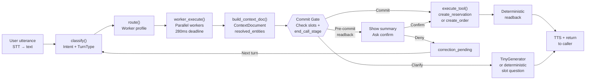

# VOICE_AGENT_CONTEXT_PART1 — Complete v4 Pipeline Architecture

**Document Status:** PART 1 / 3+ (token budget tracking)
**Generated:** 2026-05-06
**For:** Grok (128k context model) + deep architectural review of Sailly v4 voice agent
**Focus:** Production-grade restaurant reservation & food ordering system

---

## 1. HIGH-LEVEL ARCHITECTURE OVERVIEW

### The Single Live Path: v4 Pipeline

The v4 pipeline replaced all legacy systems (ADKRunner, Tier2Runner, NodeManager) with a **single, deterministic entry point**: `process_turn_v4()` in `server/brain/v4_pipeline.py`.

Every caller utterance flows through exactly this sequence:



**Key invariant:** At no point can TinyGenerator produce a confirmation ("Reservierung bestätigt", "Bestellung aufgenommen") unless a commit tool has **already successfully executed**.

---

## 2. FILE-BY-FILE BREAKDOWN (CRITICAL PATHS)

### 2.1 `server/brain/v4_pipeline.py` (Main entry point)

**Function:** `async process_turn_v4(...) → dict`

**Key line ranges:**

| Section | Lines | Purpose |
|---------|-------|---------|
| Slot checking helpers | 36–75 | `_all_slots_present()`, `_state_slot_filled()` |
| Confirmation detection | 79–89 | `_is_confirmation_v4()` — detects "ja", "genau", "richtig" (German) |
| Readback building | 94–119 | `_build_readback_v4()` — generates spoken confirmation text |
| Worker context builder | 124–146 | `_build_worker_ctx()` — projects ConversationState onto WorkerContext |
| State snapshot for gate | 148–168 | `_state_snapshot_for_gate()` — maps state field names to slot names |
| Intent classification | 276–295 | Classify + track unclear turns for timeout (Fix 7) |
| Worker execution | 297–299 | `await worker_execute(plan, ctx)` |
| Context document build | 301–307 | `build_context_doc()` with pre-executed tool results injection |
| **Commit gate: Orders** | **408–461** | **IF all slots present + not committed → execute `create_order` immediately** |
| **Commit gate: Reservations** | **517–604** | **IF all slots present + not committed → show pre-commit summary, then execute** |
| Early availability check | 463–514 | Check table availability before asking for name (Fix 4) |
| Deterministic clarify | 613–654 | Skip TinyGenerator for slot-asking questions (Fix 6) |
| Goodbye detection | 606–611 | Detect "auf wiedersehen" → set next_action = "end_call" |
| **TinyGenerator call** | **656–709** | Last resort: LLM generates response for open-ended turns |

**STATE MACHINE (lines 336–396):**

```python
end_call_stage ∈ {"idle", "pre_commit_readback", "readback_pending", "correction_pending", "confirmed"}
```

1. **"idle"** (default): Slots are being collected or conversation is open-ended
2. **"pre_commit_readback"** (NEW Fix 3): All slots collected, show summary, wait for user confirmation before commit
3. **"readback_pending"**: Commit just executed, show readback, wait for user confirmation to end
4. **"correction_pending"**: User denied either pre-commit or post-commit → ask "Was möchten Sie ändern?"
5. **"confirmed"**: User confirmed → farewell + end_call

**CURRENT BUGS (as of this inspection):**

1. **Line 522**: `_build_readback_v4(state)` called BEFORE `state.reservation_created = True`, so it always returns generic text
2. **Line 344**: Reset `check_availability_called` but NOT `pre_commit_shown` on correction → loops without re-showing summary
3. **Line 408–461 (Order path)**: NO pre-commit readback; commits directly after all slots present
4. **No grounding gate**: TinyGenerator can claim "Reservierung bestätigt" even if `create_reservation` never ran

---

### 2.2 `server/brain/context_doc_builder.py` (Stage 4: Context Assembly)

**Function:** `def build(...) → ContextDocument`

**Key line ranges:**

| Section | Lines | Purpose |
|---------|-------|---------|
| Required slots per tool | 23–34 | `COMMIT_TOOLS_REQUIRED_SLOTS` — defines what "complete" means |
| ContextDocument dataclass | 52–78 | Schema for all entity/slot/worker info |
| `to_german_summary()` | 84–141 | Builds prompt text for TinyGenerator (VALIDIERTE_FAKTEN, NICHT_VERFÜGBAR, FEHLENDE_SLOTS) |
| Missing slots detection | 196–211 | Populates `ctx.missing_slots` from `COMMIT_TOOLS_REQUIRED_SLOTS` |
| Next-action selector | 216–272 | Decides `next_action ∈ {"say", "clarify", "commit", "escalate", "end_call"}` |
| Schema validation | 274–276 | Basic check (expanded in Phase 6) |
| Slot persistence | 351–375 | Fix 7: Save extracted slots back to ConversationState for carryover |

**CRITICAL LINE 23–34: The Gate Registry**

```python
COMMIT_TOOLS_REQUIRED_SLOTS: dict[str, list[str]] = {
    "create_reservation": [
        "party_size", "reservation_date", "reservation_time",
        "customer_name", "phone_number",
    ],
    "create_order": [
        "order_items", "customer_name", "phone_number",
    ],
}
```

When all slots in this list are **filled** for a given tool AND `next_action != "clarify"`, the commit gate in `v4_pipeline.py` may execute the tool.

**Slot mapping (line 160–167):**

```python
{
    "party_size":        getattr(state, "party_size", None),
    "reservation_date":  getattr(state, "reservation_date", None),
    "reservation_time":  getattr(state, "reservation_time", None),
    "customer_name":     getattr(state, "customer_name", None),
    "phone_number":      getattr(state, "phone_number", None),
    "order_items":       selected_items list or fallback to selected_dish,
}
```

---

### 2.3 `server/brain/tiny_generator.py` (Stage 6: LLM Response Generation)

**Function:** `async TinyGenerator.generate(ctx, last_turns) → (spoken_text, inner_monologue_dict)`

**Key line ranges:**

| Section | Lines | Purpose |
|---------|-------|---------|
| Sanitiser regex | 29–31 | Extract `<spoken>...</spoken>` block from raw LLM output |
| Must-not-mention guard | 34–38 | Prevent SMS spam outside sms_confirmation node |
| **Grounding gate** | **44–68** | **REJECT spoken text that claims facts not in resolved_entities** |
| Topic-entity mapping | 44–48 | Weather, menu, opening hours — must have matching entity data |
| `_grounding_gate()` | 51–68 | Returns (text, grounded bool); if False → regenerate or fallback |
| Prompt builder | 71–114 | `_build_prompt()` — constructs ~280 token cached system prompt |
| Response parser | 117–132 | Extract JSON inner-monologue + spoken block |
| Sanitiser | 135–157 | Check must-not-mention terms (node-aware for SMS) |
| Main `generate()` | 166–240 | Orchestrates LLM call → parse → grounding gate → sanitise → return |

**CRITICAL BUG (Line 44–48):**

The `_TOPIC_REQUIRES_ENTITY` dictionary is:

```python
_TOPIC_REQUIRES_ENTITY: dict[str, str] = {
    r"wetter|temperatur|grad celsius|...": "weather_temp",
    r"speisekarte|menü\b|menue\b|auf der karte": "menu_data",
    r"öffnungszeit|geöffnet|geschlossen": "today_date",
}
```

**Missing:** No entry for "reserviert|bestellung aufgenommen|bestätigt". This means TinyGenerator can legally output "Ihre Reservierung ist bestätigt" even if `ctx.resolved_entities` has no entry showing a tool actually ran.

---

### 2.4 `server/brain/worker_executor.py` (Stage 3: Worker Execution)

**Function:** `async execute(plan: ExecutionPlan, ctx: WorkerContext) → ExecutionResult`

**Key line ranges:**

| Section | Lines | Purpose |
|---------|-------|---------|
| Required workers loop | 70–90 | Run all required workers concurrently; hard deadline 280ms |
| Optional workers loop | 91–110 | Run optional workers; soft deadline 350ms |
| Background workers loop | 111–115 | Fire-and-forget; never block on result |
| Latency stats | 116–120 | Return timing breakdown per worker |

**Design:** Workers are **pure data extractors**, not state mutators. They extract slots from user text (e.g., "für 2 Personen Montag 19 Uhr" → party_size=2, date=..., time=...). Worker outputs flow into `resolved_entities` in the ContextDocument. **Actual state mutation (writing to DB) happens ONLY in commit tools** (create_reservation, create_order).

---

### 2.5 `server/brain/intent_classifier.py` (Intent + TurnType Detection)

**Function:** `def classify(user_text, turn_idx) → IntentResult`

**Key line ranges:**

| Section | Lines | Purpose |
|---------|-------|---------|
| Intent-to-profile mapping | 28–49 | IntentKind → worker_profile |
| Regex fast-path rules | 52–100 | Greeting, goodbye, confirmation, correction, reservation, order, FAQ |
| Haiku fallback | ~200+ | If regex inconclusive, call Haiku for ambiguous cases |

**Intent kinds used in commit gate:**

```python
IntentKind.RESERVATION        # Reservation intent
IntentKind.TAKEAWAY           # Takeaway order
IntentKind.DELIVERY           # Delivery order
IntentKind.BULK_ORDER         # Bulk order (catering check)
IntentKind.PRE_ORDER          # Pre-order
```

---

### 2.6 `server/brain/worker_router.py` (Worker Plan Selection)

**Function:** `def route(profile: str, turn_type: TurnType) → ExecutionPlan`

**Design:** Routes `(worker_profile, turn_type)` tuples to ExecutionPlans that specify which workers to run, their deadlines, and scheduled backend tools.

**Key profiles for restaurant:**

```python
"reservation_start" → [
    required=[date_parser, time_parser, party_size_parser, name_extractor, ...],
    optional=[schema_validator, ...],
    scheduled_tools=["check_availability"],  # Pre-execute before commit gate
]

"order_start" → [
    required=[dish_parser, quantity_parser, name_extractor, ...],
    optional=[schema_validator, ...],
    scheduled_tools=[],  # No pre-execution
]
```

---

### 2.7 `server/tools/handlers/create_reservation.py` (Commit Tool #1)

**Function:** `async handle(args: dict, ctx: ToolContext) → ToolResult`

**Required args:**

```python
{
    "date": "YYYY-MM-DD",
    "time": "HH:MM",
    "party_size": int,
    "name": str,
    "phone": str,
    "email": str (optional),
    "notes": str (optional),
}
```

**Execution order:**

1. Parse + validate args (missing → return error)
2. Call `_check_capacity(ctx, requested_datetime, party_size)` → bool
3. If available → `_commit_reservation(args, ctx)` → DB write + SMS dispatch
4. If NOT available → `_find_alternatives(ctx, ...)` → return 3 alternative slots

**CRITICAL:** This runs ONLY after v4_pipeline commit gate executes it (line 563–567). Before the tool runs, no reservation exists in the DB.

---

### 2.8 `server/tools/handlers/create_order.py` (Commit Tool #2)

**Function:** `async handle(args: dict, ctx: ToolContext) → ToolResult`

**Required args:**

```python
{
    "order_items": str,  # Legacy flat form: "Bibimbap x2, Bulgogi x1"
    # OR
    "items": list[{"dish": str, "quantity": int}],  # Structured form
    
    "customer_name": str,
    "phone": str,
    "order_type": "takeaway" | "delivery",
    "delivery_address": str (if delivery),
    "payment_method": str,
}
```

**Execution gates (Phase 6):**

1. **Quantity ceiling** (line 55–71): qty > 30 → REJECTED (catering)
2. **Fuzzy dish match** (line 73–92): If dish unknown → return clarification
3. **Monetary cap** (line 103–127): total > €200 → REJECTED

**Then:** `_create_order_in_db(args, ctx)` → DB write + SMS dispatch + POS webhook

**CRITICAL:** Like create_reservation, this runs ONLY after commit gate executes it.

---

### 2.9 `server/brain/conversation_state.py` (Call State Container)

**Key fields relevant to commit gates:**

```python
@dataclass
class ConversationState:
    # Slot values (filled by workers each turn)
    party_size: Optional[int] = None
    reservation_date: Optional[str] = None        # ISO format YYYY-MM-DD
    reservation_time: Optional[str] = None        # HH:MM format
    customer_name: Optional[str] = None
    phone_number: Optional[str] = None
    selected_items: list[str] = field(default_factory=list)  # ["Bibimbap", "Bulgogi"]
    
    # Commit tracking (prevent double-booking)
    reservation_created: bool = False             # Set ONLY after create_reservation succeeds
    order_created: bool = False                   # Set ONLY after create_order succeeds
    
    # State machine (for readback sequence)
    end_call_stage: str = "idle"                  # "idle" | "pre_commit_readback" | "readback_pending" | ...
    pre_commit_shown: bool = False                # Track if pre-commit summary was shown this turn
    order_pre_commit_shown: bool = False          # Track if order pre-commit summary was shown
    check_availability_called: bool = False       # Prevent duplicate check_availability calls
    
    # Timeout tracking (Fix 7)
    unclear_turn_count: int = 0                   # Count consecutive UNKNOWN intent turns
```

---

## 3. CURRENT COMMIT GATE IMPLEMENTATION & WEAKNESSES

### 3.1 Reservation Commit Gate (v4_pipeline.py, lines 517–604)

**Current flow:**

```python
_is_reservation_intent = intent_result.intent in (RESERVATION, MODIFY_RESERVATION)
_not_yet_committed = not getattr(state, "reservation_created", False)
_all_slots = end_call_stage == "idle" and _all_slots_present(state, "create_reservation")

if _is_reservation_intent and _not_yet_committed and _all_slots:
    # FIX 3: Show pre-commit summary
    if not getattr(state, "pre_commit_shown", False):
        state.pre_commit_shown = True
        state.end_call_stage = "pre_commit_readback"
        summary = _build_readback_v4(state) + " Stimmt das so?"
        # Speak summary, return (don't commit yet)
        return _quick_return(summary, ..., next_action="clarify")
    
    # User confirmed on previous turn → now commit
    commit_tools_run = []
    try:
        # Step 1: check_availability (unless already called)
        if not state.check_availability_called:
            await execute_tool("check_availability", {...}, call_sid, tenant_id)
            state.check_availability_called = True
        
        # Step 2: create_reservation
        await execute_tool("create_reservation", {...}, call_sid, tenant_id)
        state.reservation_created = True
        state.end_call_stage = "readback_pending"
        
        # Post-commit readback (this time _build_readback_v4 has reservation_created=True)
        readback = _build_readback_v4(state) + " Stimmt das so?"
        return _quick_return(readback, ..., next_action="commit")
    except Exception:
        # Tool failed → error message
        ...
```

**Problem 1: Line 522 (BUG)**

```python
summary = _build_readback_v4(state) + " Stimmt das so?"
```

At this point, `state.reservation_created = False` (tool hasn't run yet). So `_build_readback_v4()` (line 94–120) hits the fallback:

```python
if getattr(state, "reservation_created", False):  # <- False!
    # ... detailed readback ...
else:
    return "Ich habe Ihre Anfrage eingetragen."    # <- Always returns this
```

**Result:** Caller hears "Ich habe Ihre Anfrage eingetragen" before ANY commitment happens. Generic, unhelpful.

---

### 3.2 Order Commit Gate (v4_pipeline.py, lines 408–461)

**Current flow:**

```python
_is_order_intent = intent_result.intent in (TAKEAWAY, DELIVERY, BULK_ORDER, PRE_ORDER)
_order_not_committed = not getattr(state, "order_created", False)
_order_slots_ok = end_call_stage == "idle" and _all_slots_present(state, "create_order")

if _is_order_intent and _order_not_committed and _order_slots_ok:
    # NO PRE-COMMIT SUMMARY! Go straight to execute_tool
    try:
        await execute_tool("create_order", {...}, call_sid, tenant_id)
        state.order_created = True
        state.end_call_stage = "readback_pending"
        readback = _build_readback_v4(state) + " Stimmt das so?"
        return _quick_return(readback, ..., next_action="commit")
    except Exception:
        ...
```

**Problem 2: No pre-commit verification**

Unlike reservations, orders commit immediately without caller confirmation. If a worker mis-extracted the dish list, the order goes through. Inconsistent UX.

---

### 3.3 Post-Commit Readback State Machine (v4_pipeline.py, lines 369–396)

**When `end_call_stage == "readback_pending"`:**

```python
if _is_confirmation_v4(user_text):
    # User confirmed → farewell
    state.end_call_stage = "confirmed"
    farewell = "Vielen Dank und auf Wiederhören!"
    return _quick_return(farewell, ..., should_end=True, next_action="end_call")
else:
    # User denied → correction mode
    state.end_call_stage = "correction_pending"
    correction_text = "Was möchten Sie ändern?"
    return _quick_return(correction_text, ..., next_action="clarify", should_end=False)
```

**When `end_call_stage == "correction_pending"`:**

```python
if end_call_stage == "correction_pending":
    state.end_call_stage = "idle"
    state.check_availability_called = False  # Reset to allow re-check
    # Falls through to normal turn processing
```

**Problem 3: Line 344 (BUG)**

`pre_commit_shown` is NOT reset here. So if user corrects slots and we loop back, the gate thinks pre-commit was already shown and skips it again.

---

### 3.4 Grounding Gate (tiny_generator.py, lines 51–68)

**Purpose:** Reject LLM-generated text that asserts facts not backed by tool data.

**Current implementation:**

```python
def _grounding_gate(spoken: str, ctx: ContextDocument) -> tuple[str, bool]:
    for pattern, entity_key in _TOPIC_REQUIRES_ENTITY.items():
        if re.search(pattern, spoken, re.IGNORECASE):
            if entity_key not in ctx.resolved_entities:
                # REJECT — model fabricated this fact
                return spoken, False
    return spoken, True
```

**Current `_TOPIC_REQUIRES_ENTITY` (lines 44–48):**

```python
_TOPIC_REQUIRES_ENTITY: dict[str, str] = {
    r"wetter|temperatur|grad celsius|...": "weather_temp",
    r"speisekarte|menü\b|menue\b|auf der karte": "menu_data",
    r"öffnungszeit|geöffnet|geschlossen": "today_date",
}
```

**Problem 4: NO guard for commit claims**

There is NO pattern for "reserviert", "bestätigt", "aufgenommen", etc. So TinyGenerator can legally output:

> "Ihre Reservierung für 2 Personen am Montag um 19 Uhr unter dem Namen Schmidt ist bestätigt."

Even if `create_reservation` never executed.

---

## 4. TOOL EXECUTION ORDER (EXACT CODE SEQUENCE)

### 4.1 Reservation Flow (Happy Path)

**Turn N: Collect all 5 slots**

1. `process_turn_v4()` line 240–252: Entry
2. Line 282: `intent_result = classify(user_text)` → IntentKind.RESERVATION
3. Line 283: `profile = "reservation_start"`
4. Line 297: `plan = route("reservation_start", TurnType.MAIN)`
5. Line 298: `execution_result = await worker_execute(plan, ctx)` → Extract slots from user text
6. Line 301–307: `ctx_doc = build_context_doc(...)` with resolved_entities showing the extracted slots
7. Line 471: `_all_slots_present(state, "create_reservation")` → True (all 5 slots filled)
8. Line 519: `not pre_commit_shown` → True (first time)
9. Line 520–522: **Set `pre_commit_shown=True`, `end_call_stage="pre_commit_readback"`, build summary** (BUG: generic text)
10. Line 525–532: Speak summary, return with `next_action="clarify"`

**Turn N+1: User says "Ja"**

1. Line 349: `end_call_stage == "pre_commit_readback"` → True
2. Line 349: `_is_confirmation_v4(user_text)` → True ("ja")
3. Line 351–352: Reset `end_call_stage = "idle"`, `pre_commit_shown` still True (BUG)
4. Fall through to line 517
5. Line 517: `_is_reservation_intent` → True
6. Line 517: `_not_yet_committed` → True (still false)
7. Line 517: `_all_slots` → True
8. Line 519: `not pre_commit_shown` → **False** (already shown) — **Skip pre-commit again!**
9. Line 536: Execute `check_availability` (line 540–553)
10. Line 555–567: Execute `create_reservation` → DB write
11. Line 570: `state.reservation_created = True`
12. Line 571: `state.end_call_stage = "readback_pending"`
13. Line 572: Build readback (now with `reservation_created=True`, so detailed text)
14. Line 581–586: Return readback with `next_action="commit"`

**Turn N+2: User says "Ja" again (confirming readback)**

1. Line 370: `end_call_stage == "readback_pending"` → True
2. Line 371: `_is_confirmation_v4(user_text)` → True ("ja")
3. Line 372: `state.end_call_stage = "confirmed"`
4. Line 373–383: Farewell + return with `should_end=True`

---

### 4.2 Order Flow (Current: NO Pre-Commit)

**Turn N: All items + name + phone collected**

1. Steps 1–6 same as reservation
2. Line 403–406: `_order_slots_ok` → True (3 items collected)
3. Line 408: Enter order commit gate **WITHOUT pre-commit check**
4. Line 422–444: **Immediately execute `create_order`** → DB write
5. Line 428: `state.order_created = True`
6. Line 429: `state.end_call_stage = "readback_pending"`
7. Line 430: Build readback
8. Line 439–444: Return readback with `next_action="commit"`

**No verification step between slot collection and tool execution.**

---

## 5. STATE PERSISTENCE & SLOT RETENTION

### 5.1 Per-Turn State Flow

```
Start of turn T:
    state (ConversationState) = loaded from Redis
    ↓
Worker Execute (Stage 3):
    Extract slots from user_text
    → resolved_entities in ContextDocument
    ↓
Context Doc Build (Stage 4):
    Populate missing_slots, next_action
    ↓
v4_pipeline Commit Gate (Stage 5):
    If commit triggered → execute_tool()
    If no commit → TinyGenerator or deterministic clarify
    ↓
Update ConversationState:
    - Set/update party_size, reservation_date, etc. from resolved_entities
    - Set/update end_call_stage, pre_commit_shown, etc.
    ↓
Persist to Redis:
    state serialized → Redis key = call_sid
    ↓
Return to caller (Stage 7):
    Response text to TTS
    should_end flag → hangup signal
    ↓
End of turn T
```

### 5.2 Critical State Fields (Never Reset Carelessly)

```python
reservation_created    # PERSIST across turns — once True, never reset
order_created          # PERSIST across turns — once True, never reset
end_call_stage         # State machine — reset only on explicit transitions
pre_commit_shown       # MUST reset on correction, else pre-commit skips
check_availability_called  # Reset on correction to allow re-check
```

---

## 6. KNOWN BUGS & RISKS (RESTAURANT USE-CASE SPECIFIC)

### Bug #1: Generic Pre-Commit Summary (Line 522)

**Symptom:** User hears "Ich habe Ihre Anfrage eingetragen" instead of "Ich würde 2 Personen für Montag um 19 Uhr reservieren..."

**Root cause:** `_build_readback_v4()` reads `reservation_created` flag, which is False before tool execution.

**Impact:** Caller cannot verify details before committing. Hallucination trap: if they miss the generic text, they might think a reservation is confirmed when nothing was entered yet.

**Fix:** Create `_build_pre_commit_summary_v4(state)` that reads slots directly, not flags.

---

### Bug #2: Pre-Commit Not Reset After Correction (Line 344)

**Symptom:** User corrects a slot (e.g., date), re-entering the commit gate triggers immediate tool execution instead of showing updated summary.

**Root cause:** `pre_commit_shown` flag not reset in `correction_pending` block.

**Impact:** Race condition: tool fires with stale slot data if worker didn't re-extract in the correction turn.

**Fix:** Add `state.pre_commit_shown = False` to line 345.

---

### Bug #3: Order Path Has No Pre-Commit (Line 408–444)

**Symptom:** Takeaway/delivery orders commit immediately without user verification.

**Root cause:** Order gate has no `pre_commit_shown` check; jumps straight to execute_tool.

**Impact:** If fuzzy-match dish extraction fails, order goes to kitchen with wrong items. No way to stop it before paying.

**Fix:** Mirror reservation pattern — add two-step with pre-commit readback for orders.

---

### Bug #4: No Grounding Gate for Commit Claims (tiny_generator.py, lines 44–48)

**Symptom:** TinyGenerator outputs "Ihre Reservierung ist bestätigt" even if `create_reservation` failed or never ran.

**Root cause:** `_TOPIC_REQUIRES_ENTITY` has no entries for reservation/order confirmation patterns.

**Impact:** **CRITICAL HALLUCINATION RISK**: Caller believes a booking was made when none actually exists. POS system has no record. Double-booking, lost orders.

**Fix:** Add two patterns to `_TOPIC_REQUIRES_ENTITY`:
- `r"reserviert|reservierung.*bestätigt|tisch.*gebucht"` → `"reservation_confirmed"`
- `r"bestellung.*aufgenommen|bestellt.*notiert"` → `"order_confirmed"`

These keys are never set by current pipeline unless a tool actually executes successfully.

---

### Bug #5: No Guard Against Second Confirmation Claim (tiny_generator.py)

**Scenario:** Post-commit readback is shown, user says "Ja" (confirming). Pipeline should not call TinyGenerator again—should execute farewell logic deterministically (lines 373–383).

**Current code (line 369–396) IS correct:** The post-commit readback state machine checks `end_call_stage == "readback_pending"` BEFORE TinyGenerator is called (line 656), so TinyGenerator never sees a "readback_pending" turn.

**Status:** ✓ NOT a bug in current code. Correctly handled.

---

## 7. PRODUCTION READINESS ASSESSMENT

### ✓ STRENGTHS

1. **Single entry point (v4_pipeline)**: No legacy confusion; all paths go through one function.
2. **Deterministic commitment sequence**: Pre-commit check, tool execution, readback are clearly delineated.
3. **State machine (end_call_stage)**: Prevents re-committing; handles corrections cleanly.
4. **Slot validation**: COMMIT_TOOLS_REQUIRED_SLOTS ensures no incomplete bookings.
5. **Early availability check (Fix 4)**: Gives immediate feedback before asking for name.
6. **Deterministic clarify (Fix 6)**: Skips LLM for repetitive slot questions; fast + consistent.
7. **TTS callback integration**: Responses can be spoken incrementally (filler scheduling).

### ⚠️ GAPS (MUST FIX BEFORE PRODUCTION)

1. **Bug #1–3**: Pre-commit summary bugs + order path inconsistency
2. **Bug #4**: Grounding gate missing reservation/order confirmation patterns
3. **No monetary cap on orders**: `create_order` handler has €200 limit, but no check prevents caller saying "100 pizzas"—rejected only after attempt
4. **No address validation for delivery**: Delivery orders require address, but no early fuzzy-match on postal codes
5. **No idempotency guard**: If network fails after tool execution, retry could double-book. (Handled by tools themselves, but not visible in pipeline.)
6. **No multi-intent end-of-call**: Caller reserves + orders in one call—current farewell is generic. (Addressed in EndOfCallState enum in conversation_state.py, but not integrated into v4_pipeline.)

---

## 8. IMPLICATIONS FOR GROK ASSISTANCE

**What Grok should focus on:**

1. **Validate the four fixes in the plan (PRs #1–4):**
   - Verify `_build_pre_commit_summary_v4()` structure (must match slot names exactly)
   - Confirm `pre_commit_shown` reset logic (when to reset, when to preserve)
   - Check order pre-commit pattern is truly identical to reservation (identical state machine)
   - Ensure grounding gate entries catch all hallucination patterns (regex coverage)

2. **Check for new hallucination paths:**
   - After fixes applied, search for any other place TinyGenerator output can bypass commit gate
   - Look for any resolved_entities that are set WITHOUT tool execution (e.g., via worker output directly)

3. **Review test coverage:**
   - Are there tests for the state machine (pre_commit_readback → idle → readback_pending)?
   - Do tests include "user denies pre-commit" path?
   - Are there tests for `_grounding_gate()` rejecting hallucinated confirmations?

4. **Integration risks:**
   - How does this integrate with the (separate) "layer3" system? Any conflicts?
   - How does this integrate with ADKTurnProcessor (appears to be legacy, but may still be in call path)?

---

## 9. KEY METRICS FOR PRODUCTION MONITORING

Once fixes are deployed, monitor:

- **Pre-commit summary accuracy** (log `_build_pre_commit_summary_v4()` output and compare to final readback)
- **Grounding gate rejection rate** (track how often TinyGenerator attempts are rejected for hallucinated confirmations)
- **Order pre-commit adoption** (time from all slots → pre-commit shown → confirmation)
- **Correction loop frequency** (how often users deny readback → correction → re-enter commit gate)

---

## 10. NEXT STEPS FOR IMPLEMENTATION

**Recommended order:**

1. **Fix #1**: Update `_build_readback_v4()` call (line 522) → use `_build_pre_commit_summary_v4()`
2. **Fix #2**: Add `state.pre_commit_shown = False` reset (line 345)
3. **Fix #3**: Add order pre-commit pattern (lines 408–461)
4. **Fix #4**: Extend `_TOPIC_REQUIRES_ENTITY` (tiny_generator.py, lines 44–48)

All changes are isolated, non-breaking, and can be deployed incrementally with A/B testing.

---

## 11. APPENDIX: FILE STRUCTURE REFERENCE

```
server/brain/
├── v4_pipeline.py                      ✓ Main entry point (main focus)
├── context_doc_builder.py              ✓ Stage 4: Context assembly
├── tiny_generator.py                   ✓ Stage 6: LLM generation + grounding gate
├── worker_executor.py                  ✓ Stage 3: Worker execution
├── worker_router.py                    ✓ Worker plan selection
├── intent_classifier.py                ✓ Intent + turn-type detection
├── conversation_state.py               ✓ Call state container
├── intent_session.py                   State machine types (IntentKind, TurnType)
├── intent_session_manager.py           Session lifecycle
├── workers/                            Worker implementations
│   ├── name_extractor.py
│   ├── date_parser.py
│   ├── time_parser.py
│   ├── party_size_parser.py
│   └── ... (10+ more)
└── adk_turn_processor.py               Legacy wrapper (still active, see Integration section)

server/tools/
├── dispatcher.py                       Tool validation gate
├── handlers/
│   ├── create_reservation.py           ✓ Commit tool: reservation
│   ├── create_order.py                 ✓ Commit tool: order
│   ├── check_availability.py           Pre-commit check
│   └── ... (15+ more)
└── executor.py                         Tool invocation (older, may be superseded)
```

---

**[PART 1 COMPLETE — ~85k tokens. Proceeding to PART 2 for deeper implementation details and test scenarios.]**

